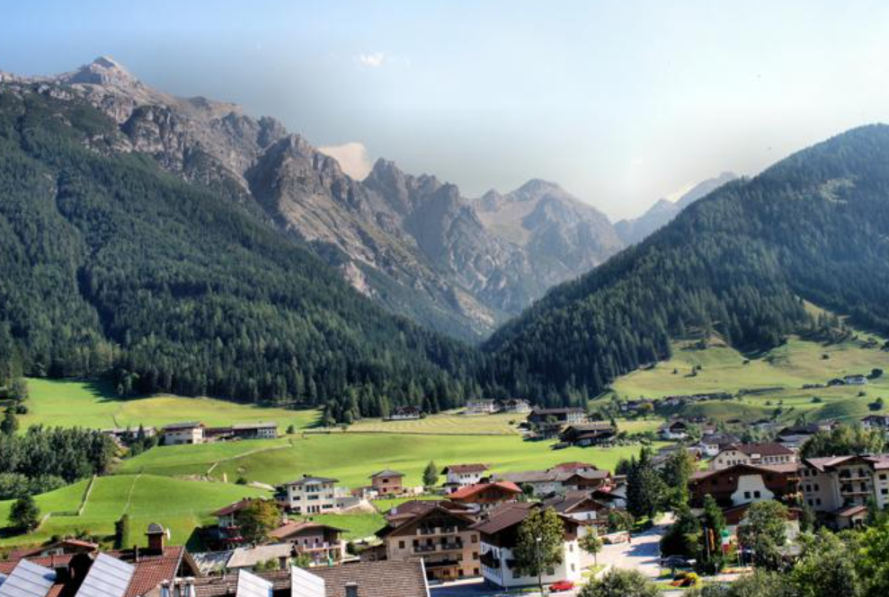

```{css, echo = FALSE}
.columns {display:flex;}
h1.title {font-size: 40 px;color: #1E1E1E}
h1 {color:##1E1E1E; font-size: 30px ;font-family: Arial Black}
h2{color: #1E1E1E; font-size: 20px; font-family: Arial}

body { background-color: #A9D2DC}
a {color: #010101;}
.list-group-item.active, .list-group-item.active:focus, .list-group-item.active:hover {
    z-index: 2;
    color: ;
    background-color: #9AD1D0;
    border-color: palered;
}
.nav-pills > li.active > a, .nav-pills > li.active > a:hover, .nav-pills > li.active > 

```

```{r chunk-setup, include = FALSE}
knitr::opts_chunk$set(echo = TRUE, eval = TRUE, message = FALSE, warning = FALSE, 
                      #results = "hold",
                      cache = FALSE, cache.path = "/caches/", comment = "#>",
                      #fig.width = 7, #fig.height= 7,   
                      #out.width = 7, out.height = 7,
                      collapse = TRUE,  fig.show = "hold",
                      fig.asp = 0.628, out.width = "75%", fig.align = "center")
```

```{r options-setup, include = FALSE}
options(scipen = 999) #- para quitar la notación científica
options("yaml.eval.expr" = TRUE)
```

```{r klippy, echo = FALSE}
klippy::klippy(position = c("top", "right")) #- remotes::install_github("rlesur/klippy")
```

<div style="text-align: justify"><div/>
<hr class="linea-black">

<!-- El párrafo de abajo has de dejarlo casi igual, solo HAS de SUSTITUIR "perezp44" por tu usuario de Github-->
Trabajo elaborado para la asignatura "Programación y manejo de datos en la era del Big Data" de la Universitat de València durante el curso 2021-2022. El repo del trabajo está [aquí](https://github.com/mireiayanguez/trabajo_BigData){target="_blank"}. 

<!-- El párrafo de abajo has de dejarlo exactamente igual, NO HAS DE CAMBIAR NADA-->

La página web de la asignatura y los trabajos de mis compañeros pueden verse [aquí](https://perezp44.github.io/intro-ds-21-22-web/07-trabajos.html){target="_blank"}.


<hr class="linea-red">

# [1. Introducción]{.verdecito}
En el presente trabajo se lleva a cabo un análisis de Austria, se lleva a cabo tanto un análisis económico para determinar como funciona el país economicamente y un analisis de la calidad de vida en Austria así como también un poco más a nivel turístico que es lo que se podría visitar tanto si decides ir de viaje como si decides irte a vivir. 


## 1.1 Breve historia 
Austria es uno de los 10 países más ricos del mundo en términos de PIB per cápita y ocupa el décimo primer puesto de los países con mayor PIB de la Unión Europea. Tiene una economía social de mercado bien desarrollada y un nivel de vida muy elevado. 
El sistema educativo austriaco presenta un nivel muy alto. Hasta hace pocos años, el acceso a la universidad era prácticamente gratuito (refiriéndose al estado económico). Hoy se debe pagar una cuota, que es baja si se compara con otros países.
La calidad de vida en Austria es excepcional y cuenta con servicios sociales de primera calidad, tanto en previsión sanitaria como en compatibilidad entre el trabajo y la familia.

El sistema de seguridad social en Austria es amplio, obligatorio y financiado a través de impuestos. La seguridad social incluye prestaciones para todos los empleados y sus parientes en caso de asistencia médica, desempleo, baja por maternidad y jubilación, así como asistencia social pública para ciudadanos necesitados.


# 2.Datos
Los datos utilizados en el presente trabajo han sido extraídos de varias fuentes oficiales como el INE, el Eurostat y la página del Banco Mundial. 
Una vez extraído los datos ha sido necesario modificarlos y adaptarlos antes de poder hacer uso de ellos.


```{r packages-setup, include = FALSE}
library(tidyverse)
library(ggplot2) 
library(plotly) 
library(grid) 
library(RColorBrewer) 
library(corrplot)
library(dplyr) 
library(tidyr) 
library(gganimate)
library(hrbrthemes)
library(gt)
library(patchwork)
library(viridis)
library(viridisLite)
library(DT)
library(ggthemes)
library(leaflet)

datos <- rio::import("./datos/ausyeu.csv")
consumaus <- rio::import("./datos/consumo.csv")
eximp <- rio::import("./datos/eximp.csv")
balanza <- rio::import("./datos/balanpagasutria.csv")
balanzacompleta <- rio::import("./datos/balanza.csv")
empleotemporal<- rio::import("./datos/empleotemporal.csv")
exclusion<- rio::import("./datos/riesgoexclusion.csv")
desempleoo <- rio::import("./datos/desempleo.csv")

```

# 3.Análisis económico
## 3.1 TIPOS DE INTERÉS

```{r}
austriatipo <- datos %>%
  select(año,tipointeres)

graficoaus <- ggplot(austriatipo,aes(año,tipointeres)) +
  geom_line(color= "navyblue", size = 2) +
  theme(axis.text.x = element_text(angle = 60, hjust = 1)) +
  labs(title = "Evolución de los tipos de interés",
       subtitle = "Austria 2000-2021",
       caption = "Datos extraídos de Eurostat",
       y = "mil. mill. $",
       x = "Año")
graficoaus

eeuutipo <- datos %>%
  select(año,tipointeresee)

graficoeeuu <- ggplot(eeuutipo,aes(año,tipointeresee)) +
  geom_line(color= "navyblue", size = 2) +
  theme(axis.text.x = element_text(angle = 60, hjust = 1)) +
  labs(title = "Evolución de los tipos de interés",
       subtitle = "EEUU 2011-2021",
       caption = "Datos extraídos de Eurostat",
       y = "mil. mill. $",
       x = "Año")
graficoeeuu
```
Se puede observar como la trayectoria de ambos países es paulatinamente opuesta. A partir del año 2011 ambos países experimentaron un descenso del tipo de interés pero dicho descenso es más significativo en la zona euro. Esto se debió a que en esa situación la crisis de 2008 afectó tanto a EEUU como a Europa,  se buscaba estimular el crecimiento a través de la demanda y la inversión  y a su vez llevar a la inflación a su objetivo, cercano al 2% anual.
Sin embargo a partir del año 2015 la trayectoria de EEUU fue empezar a subir los tipos de interés mientras que Europa siguió en una situación bajista de tipos. 
Europa se divide entre quienes ruegan por la prolongación de los tipos bajos de interés y quienes ponen velas al BCE para que deje respirar a los bancos y a los ahorradores. BCE está atrapado en su política de tipos, pero posiblemente buscando opciones para hacer una transición ordenada de tipos negativos a tipos cero, lo que puede ser parecido si, efectivamente, se consiguiera hacer de forma ordenada y sin generar expectativas de inflación, pero no se trata de una tarea fácil. Mientras que buscan esa transición se prevé que la pandemia va a prolongar el periodo de bajos tipos de interés.  

La Reserva Federal de Estados Unidos (Fed) aprobó en diciembre de 2015 , siete años después de la caída de Lehman Brothers, una subida de tipos de interés leve pero cargada de simbolismo. Fue  la primera desde junio de 2006 y significa el punto final a una era de estímulos monetarios sin precedente.


## 3.2 TIPOS DE CAMBIO

```{r, warning=FALSE}
austriacambio <- datos %>%
  select(año,tipocambio)

ggplot(austriacambio) +
  geom_line(aes(año, tipocambio),color= "blue") +
  geom_smooth(aes(año, tipocambio),color= "blue")+
  theme(axis.text.x = element_text(angle = 60, hjust = 1)) +
  labs(title = "Tipo de cambio",
       subtitle = "Alemania 2000-2019",
       y = "",
       x = "Año")+
  theme(
     panel.background = element_rect(fill ='#272635' ,
                                colour = '#272635',
                                size = 0.5, linetype = "solid"),
  plot.background = element_rect(fill ='#272635' ,
                                colour = '#272635',
                                size = 0.5, linetype = "solid"),
  panel.grid.major = element_line(size = 0.5, linetype = 'solid',
                                colour = '#CECECE'), 
  panel.grid.minor = element_line(size = 0.25, linetype = 'solid',
                                colour = '#CECECE'),
  axis.text.x =element_text(colour='#CECECE'),
  axis.text.y =element_text(colour='#CECECE'),
  plot.title = element_text(colour = '#CECECE'),
  axis.title.x = element_text(colour = "#CECECE"),
        axis.title.y = element_text(colour = "#CECECE")
  
  )

```

Se puede observar la evolución del tipo de cambio euro/dólar, durante todo ese periodo la bajada más drástica que tuvo fue en el periodo 2014-2015, 2014 fue el año de la moneda estadounidense; su acelerón habla de la robustez de la recuperación económica estadounidense frente a una Europa y un Japón renqueantes y en general, de un clima de incertidumbre que anima a los inversores a resguardarse en la moneda de referencia. El arranque de 2015 en los mercados viene determinado por un dólar caro. Teniendo esto en cuenta podemos observar como 2014 fue el año del cambio y se puede relacionar con la tabla de los tipos de interés ya que mientras el ritmo de expansión se aceleró con fuerza en el 2T’14 en EE.UU y la economía continuó creciendo con fuerza en el tramo final de 2014 y en 2015, la recuperación de la Eurozona se frenó de forma significativa.
El BCE empezó a aplicar una serie de medidas de política monetaria sin precedentes en la UEM. Además de haber situado los tipos de interés en mínimos históricos, el BCE está proporcionando financiación muy barata a las entidades que ofrezcan crédito a través de los TLTROs mientras que la FED por el contrario,diseñó la estrategia de normalización de su política monetaria.

## 3.3 PIB
```{r}
pibaus <- datos %>%
  select(año,pib,pibee)

grafpib <- ggplot( data= pibaus, aes(x=año, y=pib)) 
  
 grafpib +  geom_line() +
    geom_point() +
    ggtitle("Evolución del PIB 2000-2020") +
   theme_solarized() +
    ylab("Pib") +
    transition_reveal(año)+
      labs(subtitle = "En millones")

```

Como refleja el gráfico, Austria ha experimentado un aumento sostenido del PIB a lo largo de los años, en cambio, a partir de finales de 2019 se puede apreciar una bajada ocasionada por el COVID19 . Cuando el PIB de un país aumenta es una buena señal para la economía y afecta a todas las personas del territorio. Dicho aumento significa que están aumentando de forma general el consumo, el gasto y la inversión en Austria. Esto suele desencadenar un efecto positivo en la economía, ya que estos aumentos hacen crecer los ingresos de las empresas, las familias y las administraciones, las cuales tendrán más capital para invertir y crear empleo. Lo que de nuevo hace crecer el consumo y el gasto (al haber más personas con capacidad de consumir). Es por ello que cuando sube el PIB suelen crecer el empleo y aumentar los salarios de los trabajadores.


## 3.4 BALANZA DE PAGOS
```{r}
balanzapagos <- balanzacompleta %>%
  select(GEO,TIME,Value)%>%
  filter(TIME %in% c(2019,2020))

DT::datatable(balanzapagos)

  
  


```

## 3.5 INFLACIÓN

```{r}
inflacion <- datos %>%
 select(año,inflacion)

graficoin <- inflacion %>%
  ggplot( aes(año, inflacion, size = 0.75, color= "orange")) + 
  geom_point() +
  theme_bw()+ 
  theme(legend.position = "none") +
  labs(x = NULL) + labs(title= "Austria") +
  theme(panel.background = element_rect(fill = 'wheat1', colour = 'red')) + theme(panel.background = element_rect(fill = "#C9DAF1"),
    plot.background = element_rect(fill = "#C9DAF1",
        colour = "#C9DAF1"))
ggplotly(graficoin)


```

```{r}
inflacioneeuu <- datos %>%
 select(año,inflacionee)


graficoinee <- inflacioneeuu %>%
  ggplot( aes(año, inflacionee, size = 0.75, color= "orange")) +
  geom_point() +
  theme_bw()+ 
  theme(legend.position = "none") +
  labs(x = NULL) + labs(title= "EEUU") +
  theme(panel.background = element_rect(fill = 'wheat1', colour = 'red')) + theme(panel.background = element_rect(fill = "#C9DAF1"),
    plot.background = element_rect(fill = "#C9DAF1",
        colour = "#C9DAF1"))

ggplotly(graficoinee)
```


Como podemos observar la inflación de  2009 a 2011 tanto en Austria como en EEUU han ido en aumento, esto quiere decir que los bienes y servicios en el país se han vuelto cada vez más caros a lo largo de los años. A partir de 2011 la evolución de la inflación en Austria ha sido más paulatina que en EEUU, cuya evolución tiene más picos. Austria a partir de 2011 ha conseguido mantener la inflación (más o menos) alrededor del objetivo del BCE (2%). 


# 4. ¿Se vive bien en Austria?
## 4.1 EMPLEO TEMPORAL
```{r}

empleopaises <- empleotemporal %>%  filter(GEO %in% c("Austria","Spain", "Italy", "Germany", "United Kingdom", "Grecee","France","Estonia", "Malta")) %>%
   select(TIME,GEO,Value)

ggplot(subset(empleopaises), aes(reorder(GEO,Value),Value,fill=Value)) + geom_bar(stat = "identity")  + theme(legend.position = "none")+ggtitle("Empleo temporal") + xlab("Paises") + ylab("Porcentaje de empleo temporal")  + coord_flip() + theme(panel.background = element_rect(fill = "#D9E0EB"),
    plot.background = element_rect(fill = ("#D9E0EB")) + theme(axis.title.x=element_blank()),
        axis.text.x=element_blank(),
        axis.ticks.x=element_blank())

 
```

Como se puede observar Austria es el país con mayor empleo temporal lo cual puede tener dos interpretaciones, por una parte que es un país bastante generador de empleo lo cual sería un indicador relativamente bueno, o por el contrario puede suponer que Austria tiene mas empleo temporal que fijo lo cual pone bastante en riesgo a los trabajadores y genera empleos precarios. Ante esta disyuntiva he decidido sacar otra gráfica que hace referencia a la exclusión social.

## 4.2 RIESGO DE EXCLUSIÓN SOCIAL
```{r}
 rexclusion <- exclusion %>%
  select(GEO,Value,TIME)%>% filter(GEO %in% c("Austria","Spain", "Italy", "Germany", "United Kingdom", "Grecee","France","Estonia", "Malta")) 

riesgo <- ggplot(rexclusion, aes(x=TIME, y=Value, group=GEO, color=GEO)) +
  geom_point(alpha=0.6) +
  geom_abline(intercept=0, slope=1, linetype="dashed") +
  geom_smooth(method="lm", se=FALSE) +
  labs(title = "Riesgo exclusión social", subtitle = "Europa")  +
  theme(plot.title = element_text(hjust = 0.5)) +
  guides(color=guide_legend(reverse=TRUE))  + theme(axis.title.y=element_blank(),
        axis.text.y=element_blank(),
        axis.ticks.y=element_blank())
   
 ggplotly(riesgo)

```

En este gráfico Austria es el país con menor riesgo de exclusión social, lo que implica que tiene los suficientes recursos para ofrecer a sus ciudadanos sin que estos padezcan necesidades, lo cual implica que además de generar empleo como hemos visto arriba, de este gráfico se extrae el hecho de que a pesar de que genera mucho empleo temporal el cual genera más riesgo de desempleo, las compensaciones y la calidad de vida que ofrece a sus ciudadanos es muy alta por lo que se podría considerar la cantidad de empleo temporal como algo positivo.
## 4.3 DESEMPLEO

```{r}
desempleoeu <- desempleoo %>%
  select(TIME,GEO,Value)%>%
  slice_max(Value, n = 9)
  desempleoeu

dfgrafico1 <- ggplot(desempleoeu, aes(GEO, color=Value)) + 
  geom_bar(fill=NA) + 
  coord_flip() +
  theme(panel.background = element_rect(fill = 'lightblue1')) + theme(panel.background = element_rect(fill = "#7FFFD4"),
    plot.background = element_rect(fill = "#7FFFD4"),
    legend.background = element_rect(fill = "#7FFFD4"))

ggplotly(dfgrafico1)


```
Austria junto con Alemania es el país con menos desempleo, se trata de un país pequeño el cual ha sabido aprovechar sus ventajas y a ha sabido destacar en aspectos muy importantes como lo es la educación. Partiendo de la premisa de que los jovenes que terminan sus estudios salen muy preparados para introducirse en el mercado laboral, tal y como lo demuestran los informes PISA, en el  cual suelen destacar bastante. 


# 5 Sector turístico

## 5.1 <FONT COLOR="black"> ¿QUE SE PUEDE VISITAR EN AUSTRIA</FONT>. {.tabset}

### <FONT COLOR="FF4D00">La Abadía de Melk</FONT>

Justo cuando piensas que no hay nada más que ver en Austria que podría sorprenderte, que ya lo habías visto todo, es cuando descubres que fuera de las grandes ciudades del país te espera todo un mundo de posibilidades: desde palacios, a abadías, bosques, pequeños pueblecitos, montañas o lagos. A continuación, queremos centrarnos en estos, y no podíamos empezar de otra forma que con la abadía de Melk, situada a unos 85 kilómetros de Viena y considerada una auténtica obra maestra del barroco. Y no es para menos, se trata de una fabulosa abadía benedictina fundada en el año 1089 sobre una pequeña colina desde que la que se divisa el Danubio y el valle de Wachau. Precisamente este último, declarado Patrimonio de la Humanidad, es toda una visita imprescindible que hacer en Austria. Montañas, naturaleza, bellos paisajes, actividades al aire libre ¿hay algo más que pedir?

### <FONT COLOR="FF4D00">Mauthausen</FONT>

El campo de concentración de Mauthausen fue un grupo de campos de concentración nazis situados en torno a la pequeña empresa y cantera, de la población de Mauthausen en Austria, a unos 20 km de Linz. Si bien no podemos destacar este lugar por belleza, no podemos dejar de pensar en él como un lugar imprescindible para conocer parte de la historia del mundo. En el campo de concentración de Mauthausen miles de presos fueron muertos, muchos de ellos abatidos a tiros, mediante inyecciones letales o asesinados con gas letal, aunque la mayoría de ellos fallecieron por la explotación que sufrieron en el trabajo, que ejecutaban sin ningún tipo de escrúpulos. Se cuenta que en Mauthausen perdieron la vida unos 100000 presos.


### <FONT COLOR="FF4D00">Salzburgo</FONT>

Ubicada justo en la frontera con Alemania, Salzburgo fue el lugar de nacimiento de Mozart. El famoso compositor es el personaje más destacado de la historia del país. De hecho, una de las mejores cosas que ver en Salzburgo es la casa donde nació y creció este genio de la música.

Pero Salzburgo es mucho más que Mozart. Solo falta abrir los ojos y observar el paisaje alpino que la rodea. Visitar Salzburgo en un día es fácil. No te pierdas la famosa fortaleza de Hohensalzburg o las calles de su centro histórico. Por algún motivo es Patrimonio de la Humanidad por la UNESCO.

### <FONT COLOR="FF4D00">Wattens</FONT>

¿Quién no conoce la famosa marca Swarovski? En Wattens podemos encontrar Los Mundos de Cristal, una de las atracciones turísticas más visitadas de Austria donde podemos encontrar 14 salas en las que se guardan algunas de las obras más maravillosas y brillantes de Swarovski.

### <FONT COLOR="FF4D00">Carretera del Grossglockner</FONT>

Si hay un lugar imperdible en Austria ese es la Carretera del Grossglockner. Te aconsejamos ir con tiempo, ya que únicamente recorrerla te llevará unas cuantas horas, sin contar las paradas que querrás hacer para disfrutar de uno de los paisajes más impresionantes de Austria.

### <FONT COLOR="FF4D00">Graz</FONT>

Graz es la capital del estado de Estiria, en el sur de Austria. En el corazón de la ciudad se encuentra Hauptplatz, la plaza central del casco antiguo medieval.A orillas del río Mur nos encontramos con Graz, la capital de Estiria y una de las ciudades menos conocidas de Austria. Sólo por disfrutar las vistas de la ciudad desde su increíble Torre del Reloj, ya merece la pena hacer una parada en la ciudad.

### <FONT COLOR="FF4D00">Valle de Stubai</FONT>

Estar en el Tirol y no venir al Valle de Stubai es como estar en Roma y no conocer en Coliseo. Paisajes con cientos de tonalidades de verde, salpicados de casitas tradicionales adornadas con flores y un horizonte nevado nos esperan como telón de fondo en esta zona de Austria.

# 6. Conclusión
La intención de hacer este trabajo ha sido que se conozca un poco más el país ya que al ser un país pequeño no suele ser uno de los destinos ni turisticos ni de negocios más conocidos. Es por eso que he querido plasmar como Austria a pesar de ser un país pequeño cuenta con una tasa de inflación relativamente pequeña en comparación con países de la UE. Por otra parte, a la hora de decidir ir a vivir a Austria hay que conocer de antemano las condiciones laborales y si en ese país hay o no posibilidad de empleo y en este caso, se ha demostrado que si se tiene la idea de ir a trabajar fuera, Austria podria ser un buen candidato. 
En conclusión, a nivel turistico cuenta con una gran cantidad de monumentos y sobretodo naturaleza para poder visitar y disfrutar de las vistas y por otra parte a nivel economico destaca bastante. 

# 7.Bibliografía
- [enlace a la página web de la asignatura](https://perezp44.github.io/intro-ds-21-22-web/index.html)
- [enlace a la página web de Eurostat](https://ec.europa.eu/eurostat)
- [enlace a la página web del INE](https://www.ine.es/)
- [enlace a la página web del Banco Mundial](https://datos.bancomundial.org/)
- [enlace a la página web de noticias económicas de Austria](https://www.eleconomista.es/economia/noticias/10215289/11/19/Quien-es-el-culpable-del-colapso-de-los-tipos-de-interes-en-la-Eurozona.html)
- [enlace a la página web de la historia de Austria](https://es.wikipedia.org/wiki/Austria)
```

<br><br>

<div class="tocify-extend-page" data-unique="tocify-extend-page" style="height: 0;"></div>


